# แผนภาพ (Diagrams)

รวมแผนภาพของระบบทั้งหมดที่ถอดจากเอกสารขั้น 1-4 เป็นภาพให้ดูได้ในเว็บนี้ ซูมและลากได้ทุกภาพ ภาพมีรหัสหน้าตรงกับ [หน้าและเส้นทาง](pages-and-routes.md) และ [Flows](flows.md)

**วิธีอ่านสี:** 🟦 ฟ้า = หน้าจอ / ขั้นตอน · 🟥 แดง = ข้อผิดพลาดหรือเส้นทางปัญหา · 🟩 เขียว = ผลลัพธ์ปลายทาง · ⬜ เทา = การกระทำของระบบ

| # | แผนภาพ | ตอบคำถาม |
|---|---|---|
| 1 | ผู้ใช้ → เป้าหมาย | ใครต้องการอะไร และเทคโนโลยีไหนรองรับ |
| 2 | Sitemap | มีหน้าอะไรบ้าง ใครเห็น |
| 3 | พื้นที่ทำงาน 9 ขั้น | ลำดับขั้นและสถานะของแต่ละขั้น |
| 4 | เส้นทางหนึ่งภาคเรียน | ใครทำอะไรกับใคร ตามลำดับเวลา |
| 5 | User flows F1-F12 | คลิกอย่างไรทีละขั้น และพังตรงไหนได้ |
| 6 | วงจรสถานะ | สถานะของ profile, ขั้น, ปัญหา, คำขอ, การรัน |

---

## 1. ผู้ใช้ → เป้าหมาย → เทคโนโลยี

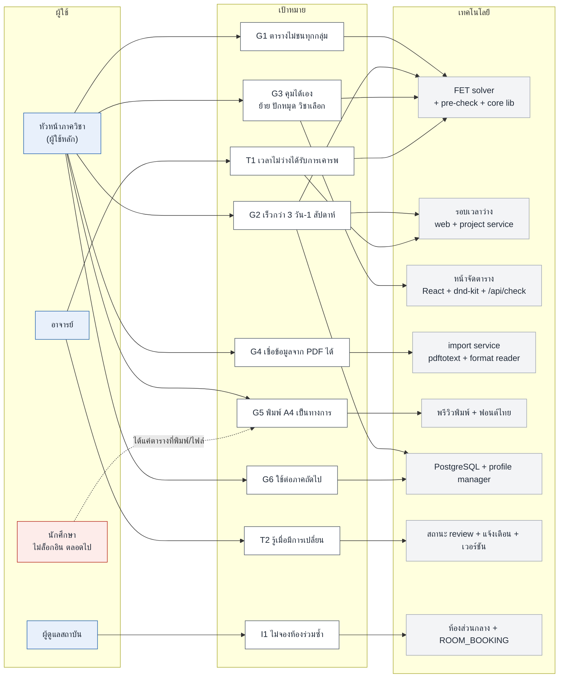
```mermaid
flowchart LR
  classDef user fill:#e8f0fb,stroke:#1f5fae,color:#1f2937
  classDef goal fill:#fff,stroke:#4b5563,color:#1f2937
  classDef tech fill:#f3f4f6,stroke:#9ca3af,color:#1f2937
  classDef no fill:#fdecea,stroke:#b42318,color:#1f2937

  subgraph U["ผู้ใช้"]
    HEAD["หัวหน้าภาควิชา<br/>(ผู้ใช้หลัก)"]:::user
    TEA["อาจารย์"]:::user
    ADM["ผู้ดูแลสถาบัน"]:::user
    STU["นักศึกษา<br/>ไม่ล็อกอิน ตลอดไป"]:::no
  end

  subgraph G["เป้าหมาย"]
    G1["G1 ตารางไม่ชนทุกกลุ่ม"]:::goal
    G2["G2 เร็วกว่า 3 วัน-1 สัปดาห์"]:::goal
    G3["G3 คุมได้เอง<br/>ย้าย ปักหมุด วิชาเลือก"]:::goal
    G4["G4 เชื่อข้อมูลจาก PDF ได้"]:::goal
    G5["G5 พิมพ์ A4 เป็นทางการ"]:::goal
    G6["G6 ใช้ต่อภาคถัดไป"]:::goal
    T1["T1 เวลาไม่ว่างได้รับการเคารพ"]:::goal
    T2["T2 รู้เมื่อมีการเปลี่ยน"]:::goal
    I1["I1 ไม่จองห้องร่วมซ้ำ"]:::goal
  end

  subgraph T["เทคโนโลยี"]
    FET["FET solver<br/>+ pre-check + core lib"]:::tech
    RND["รอบเวลาว่าง<br/>web + project service"]:::tech
    ARR["หน้าจัดตาราง<br/>React + dnd-kit + /api/check"]:::tech
    IMP["import service<br/>pdftotext + format reader"]:::tech
    PRT["พรีวิวพิมพ์ + ฟอนต์ไทย"]:::tech
    STO["PostgreSQL + profile manager"]:::tech
    NTF["สถานะ review + แจ้งเตือน + เวอร์ชัน"]:::tech
    ROOM["ห้องส่วนกลาง + ROOM_BOOKING"]:::tech
  end

  HEAD --> G1 & G2 & G3 & G4 & G5 & G6
  TEA --> T1 & T2
  ADM --> I1
  STU -.->|"ได้แค่ตารางที่พิมพ์/ไฟล์"| G5

  G1 --> FET
  G2 --> RND & FET & STO
  G3 --> ARR & FET
  G4 --> IMP
  G5 --> PRT
  G6 --> STO
  T1 --> RND & FET
  T2 --> NTF
  I1 --> ROOM
```

---

## 2. Sitemap

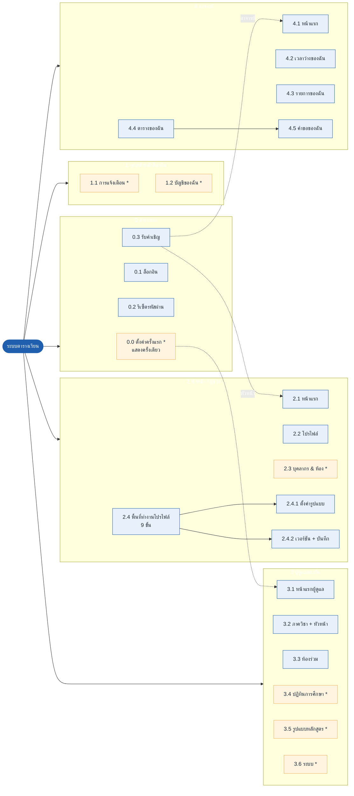
```mermaid
flowchart LR
  classDef page fill:#e8f0fb,stroke:#1f5fae,color:#1f2937
  classDef new fill:#fff4e0,stroke:#f0b45a,color:#1f2937
  classDef root fill:#1f5fae,stroke:#1f5fae,color:#fff

  R(["ระบบตารางเรียน"]):::root

  subgraph P0["0 สาธารณะ"]
    P00["0.0 ตั้งค่าครั้งแรก *<br/>แสดงครั้งเดียว"]:::new
    P01["0.1 ล็อกอิน"]:::page
    P02["0.2 รีเซ็ตรหัสผ่าน"]:::page
    P03["0.3 รับคำเชิญ"]:::page
  end

  subgraph P1["1 ทุกหน้าหลังล็อกอิน"]
    P11["1.1 การแจ้งเตือน *"]:::new
    P12["1.2 บัญชีของฉัน *"]:::new
  end

  subgraph P2["2 หัวหน้า / ผู้ช่วย"]
    P21["2.1 หน้าแรก"]:::page
    P22["2.2 โปรไฟล์"]:::page
    P23["2.3 บุคลากร & ห้อง *"]:::new
    P24["2.4 พื้นที่ทำงานโปรไฟล์<br/>9 ขั้น"]:::page
    P241["2.4.1 ตั้งค่ารูปแบบ"]:::page
    P242["2.4.2 เวอร์ชัน + บันทึก"]:::page
  end

  subgraph P3["3 ผู้ดูแลสถาบัน"]
    P31["3.1 หน้าแรกผู้ดูแล"]:::page
    P32["3.2 ภาควิชา + หัวหน้า"]:::page
    P33["3.3 ห้องร่วม"]:::page
    P34["3.4 ปฏิทินการศึกษา *"]:::new
    P35["3.5 รูปแบบหลักสูตร *"]:::new
    P36["3.6 ระบบ *"]:::new
  end

  subgraph P4["4 อาจารย์"]
    P41["4.1 หน้าแรก"]:::page
    P42["4.2 เวลาว่างของฉัน"]:::page
    P43["4.3 รายการของฉัน"]:::page
    P44["4.4 ตารางของฉัน"]:::page
    P45["4.5 คำขอของฉัน"]:::page
  end

  R --> P0 & P1 & P2 & P3 & P4
  P24 --> P241
  P24 --> P242
  P44 --> P45
  P03 -. หัวหน้า .-> P21
  P03 -. อาจารย์ .-> P41
  P00 -.-> P31
```

\* = หน้าใหม่ที่ยังไม่อยู่ในเส้นทางผู้ใช้เดิม (สีส้ม)

### 2.1 พื้นที่ทำงานโปรไฟล์: การไหลของข้อมูลระหว่างบทบาท

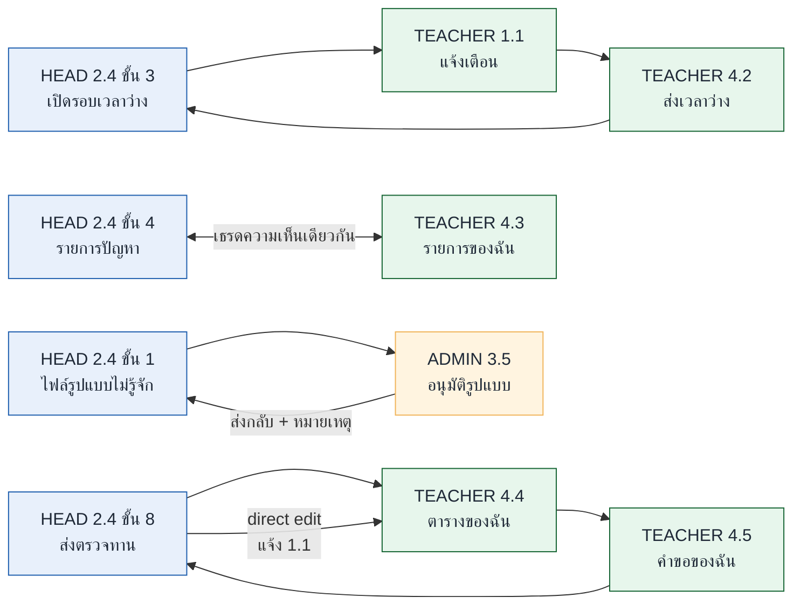
```mermaid
flowchart LR
  classDef head fill:#e8f0fb,stroke:#1f5fae,color:#1f2937
  classDef tea fill:#e7f6ec,stroke:#166534,color:#1f2937
  classDef adm fill:#fff4e0,stroke:#f0b45a,color:#1f2937

  H3["HEAD 2.4 ขั้น 3<br/>เปิดรอบเวลาว่าง"]:::head
  T1["TEACHER 1.1<br/>แจ้งเตือน"]:::tea
  T2["TEACHER 4.2<br/>ส่งเวลาว่าง"]:::tea
  H3 --> T1 --> T2 --> H3

  H4["HEAD 2.4 ขั้น 4<br/>รายการปัญหา"]:::head
  T3["TEACHER 4.3<br/>รายการของฉัน"]:::tea
  H4 <-->|"เธรดความเห็นเดียวกัน"| T3

  H8["HEAD 2.4 ขั้น 8<br/>ส่งตรวจทาน"]:::head
  T4["TEACHER 4.4<br/>ตารางของฉัน"]:::tea
  T5["TEACHER 4.5<br/>คำขอของฉัน"]:::tea
  H8 --> T4 --> T5 --> H8
  H8 -->|"direct edit<br/>แจ้ง 1.1"| T4

  H1["HEAD 2.4 ขั้น 1<br/>ไฟล์รูปแบบไม่รู้จัก"]:::head
  A35["ADMIN 3.5<br/>อนุมัติรูปแบบ"]:::adm
  H1 --> A35
  A35 -->|"ส่งกลับ + หมายเหตุ"| H1
```

---

## 3. พื้นที่ทำงานโปรไฟล์: 9 ขั้น

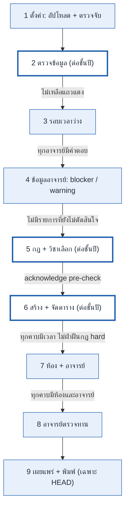
```mermaid
flowchart TB
  classDef step fill:#e8f0fb,stroke:#1f5fae,color:#1f2937
  classDef year fill:#fff,stroke:#1f5fae,stroke-width:3px,color:#1f2937

  S1["1 ตั้งค่า: อัปโหลด + ตรวจจับ"]:::step
  S2["2 ตรวจข้อมูล (ต่อชั้นปี)"]:::year
  S3["3 รอบเวลาว่าง"]:::step
  S4["4 ข้อมูลอาจารย์: blocker / warning"]:::step
  S5["5 กฎ + วิชาเลือก (ต่อชั้นปี)"]:::year
  S6["6 สร้าง + จัดตาราง (ต่อชั้นปี)"]:::year
  S7["7 ห้อง + อาจารย์"]:::step
  S8["8 อาจารย์ตรวจทาน"]:::step
  S9["9 เผยแพร่ + พิมพ์ (เฉพาะ HEAD)"]:::step

  S1 --> S2
  S2 -->|"ไม่เหลือแถวแดง"| S3
  S3 -->|"ทุกอาจารย์มีคำตอบ"| S4
  S4 -->|"ไม่มีรายการที่ยังไม่ตัดสินใจ"| S5
  S5 -->|"acknowledge pre-check"| S6
  S6 -->|"ทุกคาบมีเวลา ไม่ฝ่าฝืนกฎ hard"| S7
  S7 -->|"ทุกคาบมีห้องและอาจารย์"| S8
  S8 --> S9
```

กรอบหนา = ทำแยกต่อ **หลักสูตร × ชั้นปี** · ข้อความบนลูกศร = เงื่อนไขปลดล็อกขั้นถัดไป

**สถานะของแต่ละขั้น:** ดู วงจรสถานะ ย้อนไปแก้ขั้นที่เสร็จแล้ว → ขั้นหลังเป็น **ล้าสมัย** (เฉพาะชั้นปีนั้น ถ้าแก้ในแท็บชั้นปีเดียว)

---

## 4. เส้นทางหนึ่งภาคเรียน (ตามลำดับเวลา)

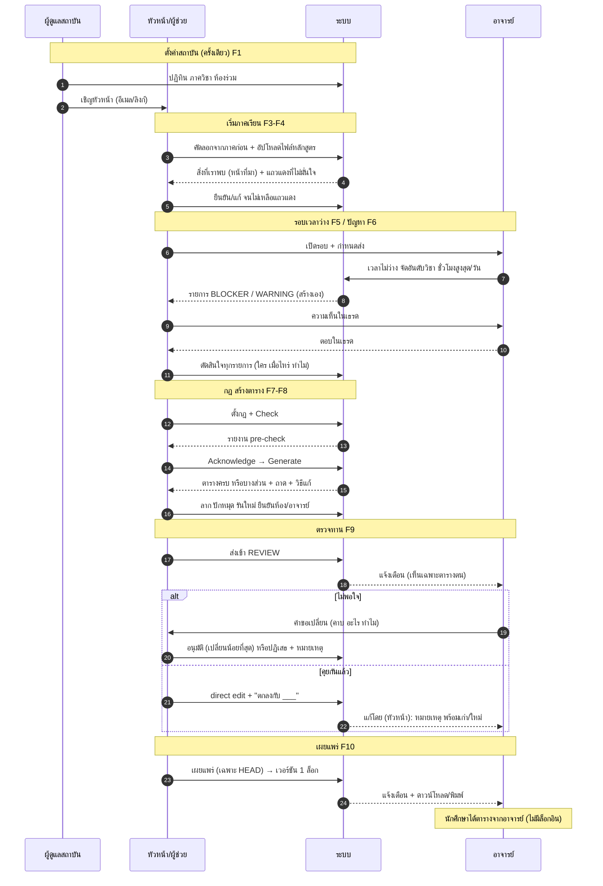
```mermaid
sequenceDiagram
  autonumber
  participant ADM as ผู้ดูแลสถาบัน
  participant HEAD as หัวหน้า/ผู้ช่วย
  participant SYS as ระบบ
  participant TEA as อาจารย์

  Note over ADM,SYS: ตั้งค่าสถาบัน (ครั้งเดียว) F1
  ADM->>SYS: ปฏิทิน ภาควิชา ห้องร่วม
  ADM->>HEAD: เชิญหัวหน้า (อีเมล/ลิงก์)

  Note over HEAD,SYS: เริ่มภาคเรียน F3-F4
  HEAD->>SYS: คัดลอกจากภาคก่อน + อัปโหลดไฟล์หลักสูตร
  SYS-->>HEAD: สิ่งที่เราพบ (หน้าที่มา) + แถวแดงที่ไม่มั่นใจ
  HEAD->>SYS: ยืนยัน/แก้ จนไม่เหลือแถวแดง

  Note over HEAD,TEA: รอบเวลาว่าง F5 / ปัญหา F6
  HEAD->>TEA: เปิดรอบ + กำหนดส่ง
  TEA->>SYS: เวลาไม่ว่าง จัดอันดับวิชา ชั่วโมงสูงสุด/วัน
  SYS-->>HEAD: รายการ BLOCKER / WARNING (สร้างเอง)
  HEAD->>TEA: ความเห็นในเธรด
  TEA-->>HEAD: ตอบในเธรด
  HEAD->>SYS: ตัดสินใจทุกรายการ (ใคร เมื่อไหร่ ทำไม)

  Note over HEAD,SYS: กฎ สร้างตาราง F7-F8
  HEAD->>SYS: ตั้งกฎ + Check
  SYS-->>HEAD: รายงาน pre-check
  HEAD->>SYS: Acknowledge → Generate
  SYS-->>HEAD: ตารางครบ หรือบางส่วน + ถาด + วิธีแก้
  HEAD->>SYS: ลาก ปักหมุด รันใหม่ ยืนยันห้อง/อาจารย์

  Note over HEAD,TEA: ตรวจทาน F9
  HEAD->>SYS: ส่งเข้า REVIEW
  SYS-->>TEA: แจ้งเตือน (เห็นเฉพาะตารางตน)
  alt ไม่พอใจ
    TEA->>HEAD: คำขอเปลี่ยน (คาบ อะไร ทำไม)
    HEAD->>SYS: อนุมัติ (เปลี่ยนน้อยที่สุด) หรือปฏิเสธ + หมายเหตุ
  else คุยกันแล้ว
    HEAD->>SYS: direct edit + "ตกลงกับ ___"
    SYS-->>TEA: แก้โดย (หัวหน้า): หมายเหตุ พร้อมเก่า/ใหม่
  end

  Note over HEAD,TEA: เผยแพร่ F10
  HEAD->>SYS: เผยแพร่ (เฉพาะ HEAD) → เวอร์ชัน 1 ล็อก
  SYS-->>TEA: แจ้งเตือน + ดาวน์โหลด/พิมพ์
  Note over TEA: นักศึกษาได้ตารางจากอาจารย์ (ไม่มีล็อกอิน)
```

---

## 5. User flows F1-F12

สัญลักษณ์: สี่เหลี่ยมมุมมน = เริ่ม/จบ · ข้าวหลามตาม = จุดแยกเส้นทาง · 🟥 = ข้อผิดพลาด

### F1 ตั้งค่าสถาบัน (ADMIN)

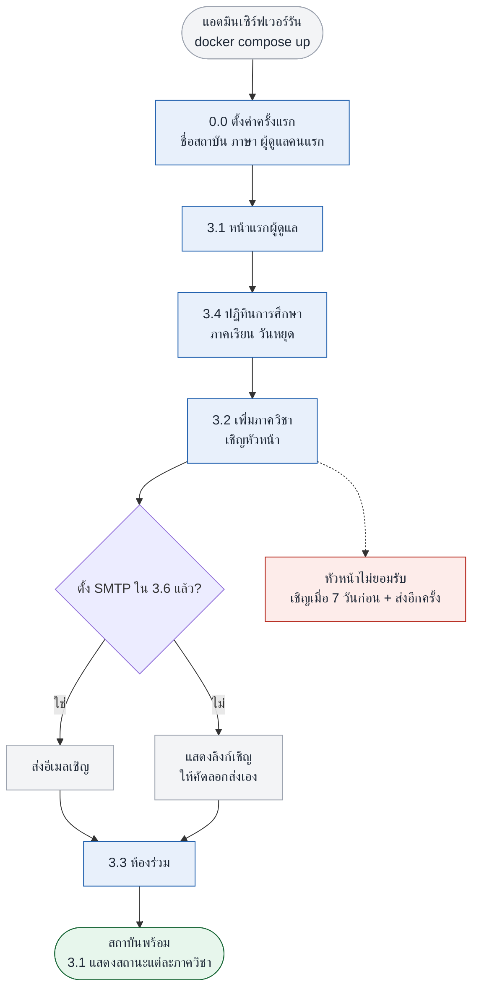
```mermaid
flowchart TD
  classDef page fill:#e8f0fb,stroke:#1f5fae,color:#1f2937
  classDef err fill:#fdecea,stroke:#b42318,color:#1f2937
  classDef ok fill:#e7f6ec,stroke:#166534,color:#1f2937
  classDef sys fill:#f3f4f6,stroke:#9ca3af,color:#1f2937

  A(["แอดมินเซิร์ฟเวอร์รัน<br/>docker compose up"]):::sys --> B["0.0 ตั้งค่าครั้งแรก<br/>ชื่อสถาบัน ภาษา ผู้ดูแลคนแรก"]:::page
  B --> C["3.1 หน้าแรกผู้ดูแล"]:::page
  C --> D["3.4 ปฏิทินการศึกษา<br/>ภาคเรียน วันหยุด"]:::page
  D --> E["3.2 เพิ่มภาควิชา<br/>เชิญหัวหน้า"]:::page
  E --> Q{"ตั้ง SMTP ใน 3.6 แล้ว?"}
  Q -->|ใช่| M["ส่งอีเมลเชิญ"]:::sys
  Q -->|ไม่| L["แสดงลิงก์เชิญ<br/>ให้คัดลอกส่งเอง"]:::sys
  M --> R["3.3 ห้องร่วม"]:::page
  L --> R
  R --> Z(["สถาบันพร้อม<br/>3.1 แสดงสถานะแต่ละภาควิชา"]):::ok
  E -.-> X["หัวหน้าไม่ยอมรับ<br/>เชิญเมื่อ 7 วันก่อน + ส่งอีกครั้ง"]:::err
```

### F2 เข้าร่วมด้วยคำเชิญ

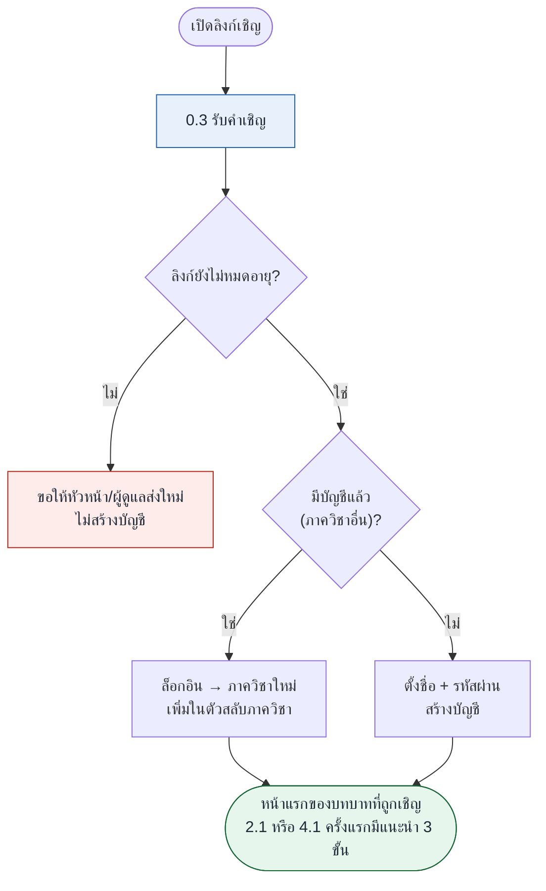
```mermaid
flowchart TD
  classDef page fill:#e8f0fb,stroke:#1f5fae,color:#1f2937
  classDef err fill:#fdecea,stroke:#b42318,color:#1f2937
  classDef ok fill:#e7f6ec,stroke:#166534,color:#1f2937

  A(["เปิดลิงก์เชิญ"]) --> B["0.3 รับคำเชิญ"]:::page
  B --> X{"ลิงก์ยังไม่หมดอายุ?"}
  X -->|ไม่| E["ขอให้หัวหน้า/ผู้ดูแลส่งใหม่<br/>ไม่สร้างบัญชี"]:::err
  X -->|ใช่| Q{"มีบัญชีแล้ว<br/>(ภาควิชาอื่น)?"}
  Q -->|ใช่| L["ล็อกอิน → ภาควิชาใหม่<br/>เพิ่มในตัวสลับภาควิชา"]
  Q -->|ไม่| N["ตั้งชื่อ + รหัสผ่าน<br/>สร้างบัญชี"]
  L --> Z(["หน้าแรกของบทบาทที่ถูกเชิญ<br/>2.1 หรือ 4.1 ครั้งแรกมีแนะนำ 3 ขั้น"]):::ok
  N --> Z
```

### F3 เริ่มตารางเรียนภาคนี้

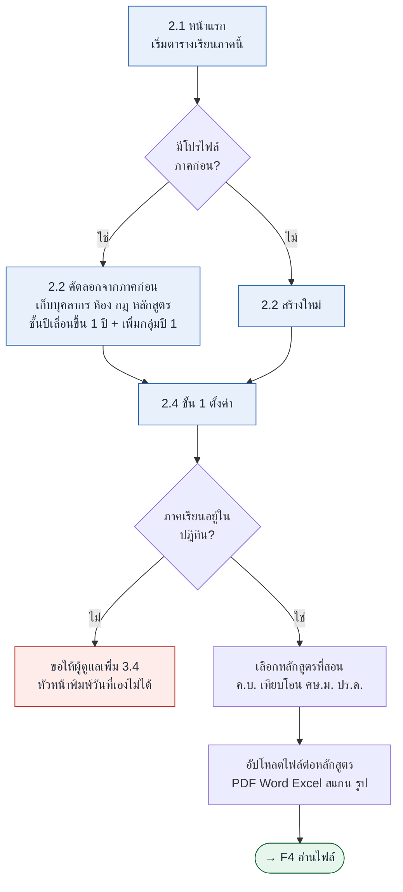
```mermaid
flowchart TD
  classDef page fill:#e8f0fb,stroke:#1f5fae,color:#1f2937
  classDef err fill:#fdecea,stroke:#b42318,color:#1f2937
  classDef ok fill:#e7f6ec,stroke:#166534,color:#1f2937

  A["2.1 หน้าแรก<br/>เริ่มตารางเรียนภาคนี้"]:::page --> Q{"มีโปรไฟล์<br/>ภาคก่อน?"}
  Q -->|ใช่| C["2.2 คัดลอกจากภาคก่อน<br/>เก็บบุคลากร ห้อง กฎ หลักสูตร<br/>ชั้นปีเลื่อนขึ้น 1 ปี + เพิ่มกลุ่มปี 1"]:::page
  Q -->|ไม่| N["2.2 สร้างใหม่"]:::page
  C --> S["2.4 ขั้น 1 ตั้งค่า"]:::page
  N --> S
  S --> T{"ภาคเรียนอยู่ใน<br/>ปฏิทิน?"}
  T -->|ไม่| E["ขอให้ผู้ดูแลเพิ่ม 3.4<br/>หัวหน้าพิมพ์วันที่เองไม่ได้"]:::err
  T -->|ใช่| P["เลือกหลักสูตรที่สอน<br/>ค.บ. เทียบโอน ศษ.ม. ปร.ด."]
  P --> U["อัปโหลดไฟล์ต่อหลักสูตร<br/>PDF Word Excel สแกน รูป"]
  U --> F4(["→ F4 อ่านไฟล์"]):::ok
```

### F4 อัปโหลดและอ่านไฟล์หลักสูตร

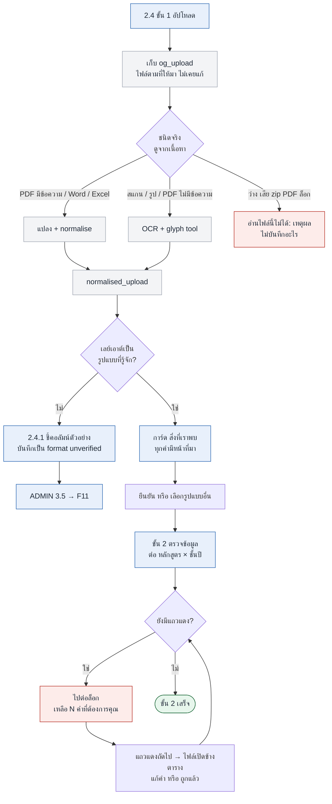
```mermaid
flowchart TD
  classDef page fill:#e8f0fb,stroke:#1f5fae,color:#1f2937
  classDef err fill:#fdecea,stroke:#b42318,color:#1f2937
  classDef ok fill:#e7f6ec,stroke:#166534,color:#1f2937
  classDef sys fill:#f3f4f6,stroke:#9ca3af,color:#1f2937

  U["2.4 ขั้น 1 อัปโหลด"]:::page --> S["เก็บ og_upload<br/>ไฟล์ตามที่ให้มา ไม่เคยแก้"]:::sys
  S --> K{"ชนิดจริง<br/>ดูจากเนื้อหา"}
  K -->|"PDF มีข้อความ / Word / Excel"| C["แปลง + normalise"]:::sys
  K -->|"สแกน / รูป / PDF ไม่มีข้อความ"| O["OCR + glyph tool"]:::sys
  K -->|"ว่าง เสีย zip PDF ล็อก"| X["อ่านไฟล์นี้ไม่ได้: เหตุผล<br/>ไม่บันทึกอะไร"]:::err
  C --> N["normalised_upload"]:::sys
  O --> N
  N --> F{"เลย์เอาต์เป็น<br/>รูปแบบที่รู้จัก?"}
  F -->|ใช่| W["การ์ด สิ่งที่เราพบ<br/>ทุกค่ามีหน้าที่มา"]:::page
  F -->|ไม่| G["2.4.1 ชี้คอลัมน์ตัวอย่าง<br/>บันทึกเป็น format unverified"]:::page
  G --> A["ADMIN 3.5 → F11"]:::page
  W --> V["ยืนยัน หรือ เลือกรูปแบบอื่น"]
  V --> R["ขั้น 2 ตรวจข้อมูล<br/>ต่อ หลักสูตร × ชั้นปี"]:::page
  R --> Q{"ยังมีแถวแดง?"}
  Q -->|ใช่| L["ไปต่อล็อก<br/>เหลือ N ค่าที่ต้องการคุณ"]:::err
  L --> Y["แถวแดงถัดไป → ไฟล์เปิดข้างตาราง<br/>แก้ค่า หรือ ถูกแล้ว"]
  Y --> Q
  Q -->|ไม่| Z(["ขั้น 2 เสร็จ"]):::ok
```

กรณีผิดพลาดเพิ่ม: วิชาเดียวกันอ่านต่างกันระหว่างแผนกับรายการวิชา → แดง แสดงสองค่า หัวหน้าเลือก · อัปโหลดไฟล์ใหม่ทับ → ขั้นหลังล้าสมัยเฉพาะหลักสูตรนั้น

### F5 รอบเวลาว่าง

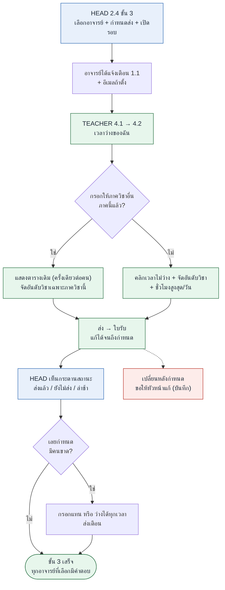
```mermaid
flowchart TD
  classDef page fill:#e8f0fb,stroke:#1f5fae,color:#1f2937
  classDef err fill:#fdecea,stroke:#b42318,color:#1f2937
  classDef ok fill:#e7f6ec,stroke:#166534,color:#1f2937
  classDef tea fill:#e7f6ec,stroke:#166534,color:#1f2937

  H["HEAD 2.4 ขั้น 3<br/>เลือกอาจารย์ + กำหนดส่ง + เปิดรอบ"]:::page --> N["อาจารย์ได้แจ้งเตือน 1.1<br/>+ อีเมลถ้าตั้ง"]
  N --> T["TEACHER 4.1 → 4.2<br/>เวลาว่างของฉัน"]:::tea
  T --> Q{"กรอกให้ภาควิชาอื่น<br/>ภาคนี้แล้ว?"}
  Q -->|ใช่| S["แสดงตารางเดิม (ครั้งเดียวต่อคน)<br/>จัดอันดับวิชาเฉพาะภาควิชานี้"]:::tea
  Q -->|ไม่| F["คลิกเวลาไม่ว่าง + จัดอันดับวิชา<br/>+ ชั่วโมงสูงสุด/วัน"]:::tea
  S --> SUB["ส่ง → ใบรับ<br/>แก้ได้จนถึงกำหนด"]:::tea
  F --> SUB
  SUB --> B["HEAD เห็นกระดานสถานะ<br/>ส่งแล้ว / ยังไม่ส่ง / ล่าช้า"]:::page
  B --> D{"เลยกำหนด<br/>มีคนขาด?"}
  D -->|ใช่| M["กรอกแทน หรือ ว่างได้ทุกเวลา<br/>ส่งเตือน"]
  D -->|ไม่| Z
  M --> Z(["ขั้น 3 เสร็จ<br/>ทุกอาจารย์ที่เลือกมีคำตอบ"]):::ok
  SUB -.-> X["เปลี่ยนหลังกำหนด<br/>ขอให้หัวหน้าแก้ (บันทึก)"]:::err
```

### F6 แก้ปัญหาจากข้อมูลอาจารย์

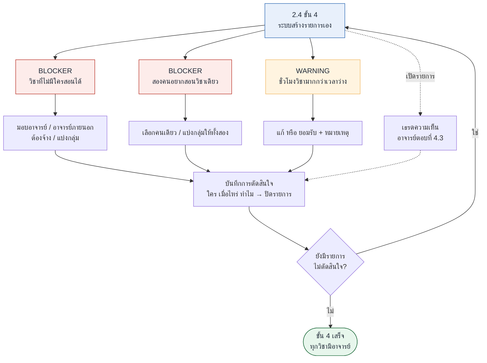
```mermaid
flowchart TD
  classDef page fill:#e8f0fb,stroke:#1f5fae,color:#1f2937
  classDef blk fill:#fdecea,stroke:#b42318,color:#1f2937
  classDef warn fill:#fff4e0,stroke:#f0b45a,color:#1f2937
  classDef ok fill:#e7f6ec,stroke:#166534,color:#1f2937

  S["2.4 ขั้น 4<br/>ระบบสร้างรายการเอง"]:::page --> B1["BLOCKER<br/>วิชาที่ไม่มีใครสอนได้"]:::blk
  S --> B2["BLOCKER<br/>สองคนอยากสอนวิชาเดียว"]:::blk
  S --> W1["WARNING<br/>ชั่วโมงวิชามากกว่าเวลาว่าง"]:::warn
  B1 --> A1["มอบอาจารย์ / อาจารย์ภายนอก<br/>ต้องจ้าง / แบ่งกลุ่ม"]
  B2 --> A2["เลือกคนเดียว / แบ่งกลุ่มให้ทั้งสอง"]
  W1 --> A3["แก้ หรือ ยอมรับ + หมายเหตุ"]
  A1 & A2 & A3 --> D["บันทึกการตัดสินใจ<br/>ใคร เมื่อไหร่ ทำไม → ปิดรายการ"]
  S -.->|"เปิดรายการ"| T["เธรดความเห็น<br/>อาจารย์ตอบที่ 4.3"]
  T -.-> D
  D --> Q{"ยังมีรายการ<br/>ไม่ตัดสินใจ?"}
  Q -->|ใช่| S
  Q -->|ไม่| Z(["ขั้น 4 เสร็จ<br/>ทุกวิชามีอาจารย์"]):::ok
```

### F7 กฎ ตรวจ สร้าง จัดตาราง

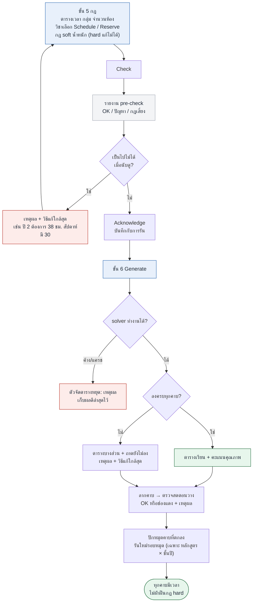
```mermaid
flowchart TD
  classDef page fill:#e8f0fb,stroke:#1f5fae,color:#1f2937
  classDef err fill:#fdecea,stroke:#b42318,color:#1f2937
  classDef ok fill:#e7f6ec,stroke:#166534,color:#1f2937
  classDef sys fill:#f3f4f6,stroke:#9ca3af,color:#1f2937

  R["ขั้น 5 กฎ<br/>ตารางเวลา กลุ่ม จำนวนห้อง<br/>วิชาเลือก Schedule / Reserve<br/>กฎ soft น้ำหนัก (hard แก้ไม่ได้)"]:::page --> C["Check"]
  C --> P["รายงาน pre-check<br/>OK / ปัญหา / กฎเสี่ยง"]:::sys
  P --> Q{"เป็นไปไม่ได้<br/>เมื่อนับดู?"}
  Q -->|ใช่| X["เหตุผล + วิธีแก้ใกล้สุด<br/>เช่น ปี 2 ต้องการ 38 ชม. สัปดาห์มี 30"]:::err
  X --> R
  Q -->|ไม่| K["Acknowledge<br/>บันทึกกับการรัน"]
  K --> G["ขั้น 6 Generate"]:::page
  G --> S{"solver ทำงานได้?"}
  S -->|"ค้าง/แครช"| E["ตัวจัดตารางหยุด: เหตุผล<br/>เก็บผลดีล่าสุดไว้"]:::err
  S -->|ได้| Y{"ลงครบทุกคาบ?"}
  Y -->|ใช่| T["ตารางเรียน + คะแนนคุณภาพ"]:::ok
  Y -->|ไม่| PT["ตารางบางส่วน + ถาดยังไม่ลง<br/>เหตุผล + วิธีแก้ใกล้สุด"]
  T --> M["ลากคาบ → ตรวจสดตอนวาง<br/>OK หรือช่องแดง + เหตุผล"]
  PT --> M
  M --> N["ปักหมุดคาบที่ตกลง<br/>รันใหม่รอบหมุด (เฉพาะ หลักสูตร × ชั้นปี)"]
  N --> Z(["ทุกคาบมีเวลา<br/>ไม่ฝ่าฝืนกฎ hard"]):::ok
```

### F8 ห้องและอาจารย์

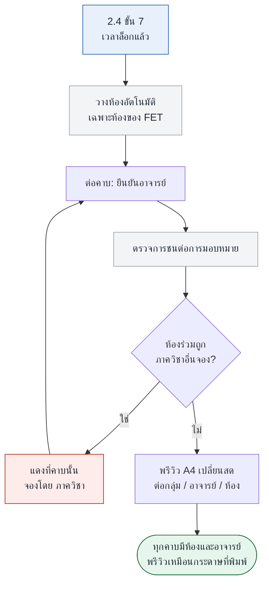
```mermaid
flowchart TD
  classDef page fill:#e8f0fb,stroke:#1f5fae,color:#1f2937
  classDef err fill:#fdecea,stroke:#b42318,color:#1f2937
  classDef ok fill:#e7f6ec,stroke:#166534,color:#1f2937
  classDef sys fill:#f3f4f6,stroke:#9ca3af,color:#1f2937

  A["2.4 ขั้น 7<br/>เวลาล็อกแล้ว"]:::page --> B["วางห้องอัตโนมัติ<br/>เฉพาะห้องของ FET"]:::sys
  B --> C["ต่อคาบ: ยืนยันอาจารย์"]
  C --> D["ตรวจการชนต่อการมอบหมาย"]:::sys
  D --> Q{"ห้องร่วมถูก<br/>ภาควิชาอื่นจอง?"}
  Q -->|ใช่| X["แดงที่คาบนั้น<br/>จองโดย ภาควิชา"]:::err
  X --> C
  Q -->|ไม่| P["พรีวิว A4 เปลี่ยนสด<br/>ต่อกลุ่ม / อาจารย์ / ห้อง"]
  P --> Z(["ทุกคาบมีห้องและอาจารย์<br/>พรีวิวเหมือนกระดาษที่พิมพ์"]):::ok
```

### F9 อาจารย์ตรวจทานและการเปลี่ยนแปลง

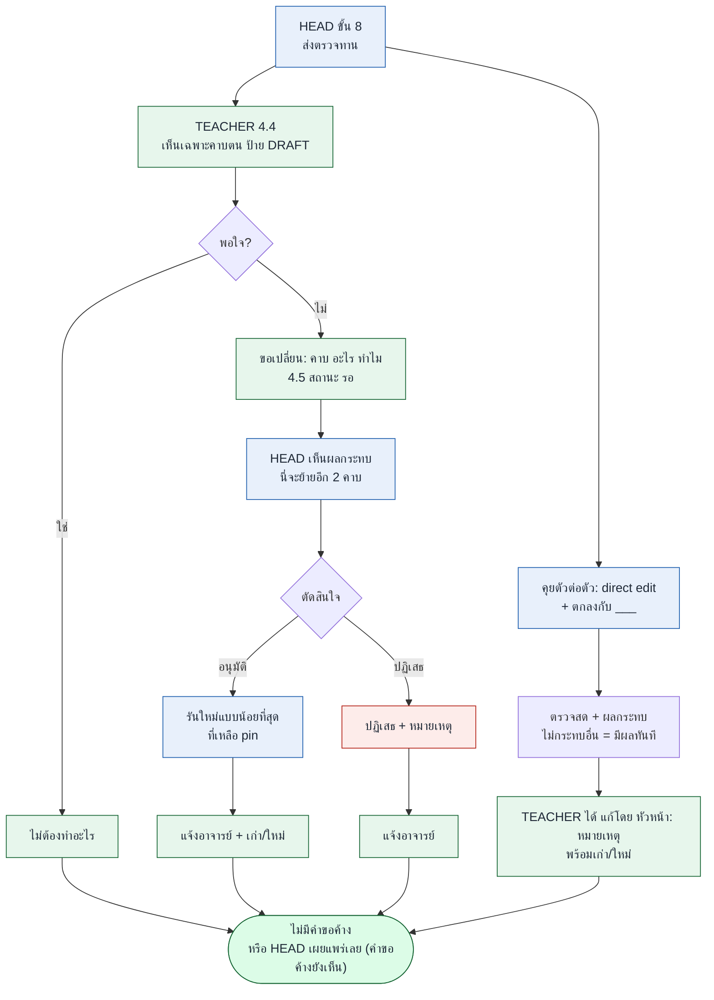
```mermaid
flowchart TD
  classDef head fill:#e8f0fb,stroke:#1f5fae,color:#1f2937
  classDef tea fill:#e7f6ec,stroke:#166534,color:#1f2937
  classDef err fill:#fdecea,stroke:#b42318,color:#1f2937
  classDef ok fill:#dcfce7,stroke:#166534,color:#1f2937

  H["HEAD ขั้น 8<br/>ส่งตรวจทาน"]:::head --> T["TEACHER 4.4<br/>เห็นเฉพาะคาบตน ป้าย DRAFT"]:::tea
  T --> Q{"พอใจ?"}
  Q -->|ใช่| N["ไม่ต้องทำอะไร"]:::tea
  Q -->|ไม่| R["ขอเปลี่ยน: คาบ อะไร ทำไม<br/>4.5 สถานะ รอ"]:::tea
  R --> I["HEAD เห็นผลกระทบ<br/>นี่จะย้ายอีก 2 คาบ"]:::head
  I --> D{"ตัดสินใจ"}
  D -->|อนุมัติ| A["รันใหม่แบบน้อยที่สุด<br/>ที่เหลือ pin"]:::head
  D -->|ปฏิเสธ| J["ปฏิเสธ + หมายเหตุ"]:::err
  A --> M["แจ้งอาจารย์ + เก่า/ใหม่"]:::tea
  J --> M2["แจ้งอาจารย์"]:::tea
  H --> E["คุยตัวต่อตัว: direct edit<br/>+ ตกลงกับ ___"]:::head
  E --> L["ตรวจสด + ผลกระทบ<br/>ไม่กระทบอื่น = มีผลทันที"]
  L --> M3["TEACHER ได้ แก้โดย หัวหน้า: หมายเหตุ<br/>พร้อมเก่า/ใหม่"]:::tea
  N --> Z
  M --> Z(["ไม่มีคำขอค้าง<br/>หรือ HEAD เผยแพร่เลย (คำขอค้างยังเห็น)"]):::ok
  M2 --> Z
  M3 --> Z
```

### F10 เผยแพร่และเปลี่ยนภายหลัง

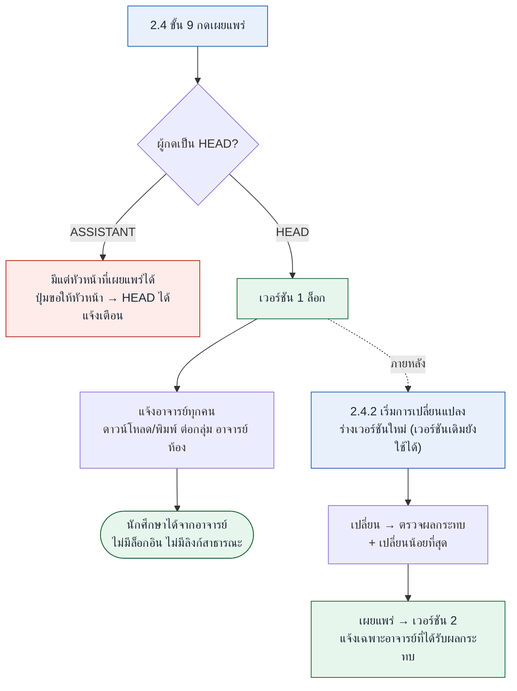
```mermaid
flowchart TD
  classDef page fill:#e8f0fb,stroke:#1f5fae,color:#1f2937
  classDef err fill:#fdecea,stroke:#b42318,color:#1f2937
  classDef ok fill:#e7f6ec,stroke:#166534,color:#1f2937

  A["2.4 ขั้น 9 กดเผยแพร่"]:::page --> Q{"ผู้กดเป็น HEAD?"}
  Q -->|"ASSISTANT"| X["มีแต่หัวหน้าที่เผยแพร่ได้<br/>ปุ่มขอให้หัวหน้า → HEAD ได้แจ้งเตือน"]:::err
  Q -->|HEAD| V["เวอร์ชัน 1 ล็อก"]:::ok
  V --> N["แจ้งอาจารย์ทุกคน<br/>ดาวน์โหลด/พิมพ์ ต่อกลุ่ม อาจารย์ ห้อง"]
  N --> S(["นักศึกษาได้จากอาจารย์<br/>ไม่มีล็อกอิน ไม่มีลิงก์สาธารณะ"]):::ok
  V -. ภายหลัง .-> C["2.4.2 เริ่มการเปลี่ยนแปลง<br/>ร่างเวอร์ชันใหม่ (เวอร์ชันเดิมยังใช้ได้)"]:::page
  C --> D["เปลี่ยน → ตรวจผลกระทบ<br/>+ เปลี่ยนน้อยที่สุด"]
  D --> P["เผยแพร่ → เวอร์ชัน 2<br/>แจ้งเฉพาะอาจารย์ที่ได้รับผลกระทบ"]:::ok
```

### F11 อนุมัติรูปแบบใหม่ (ADMIN)

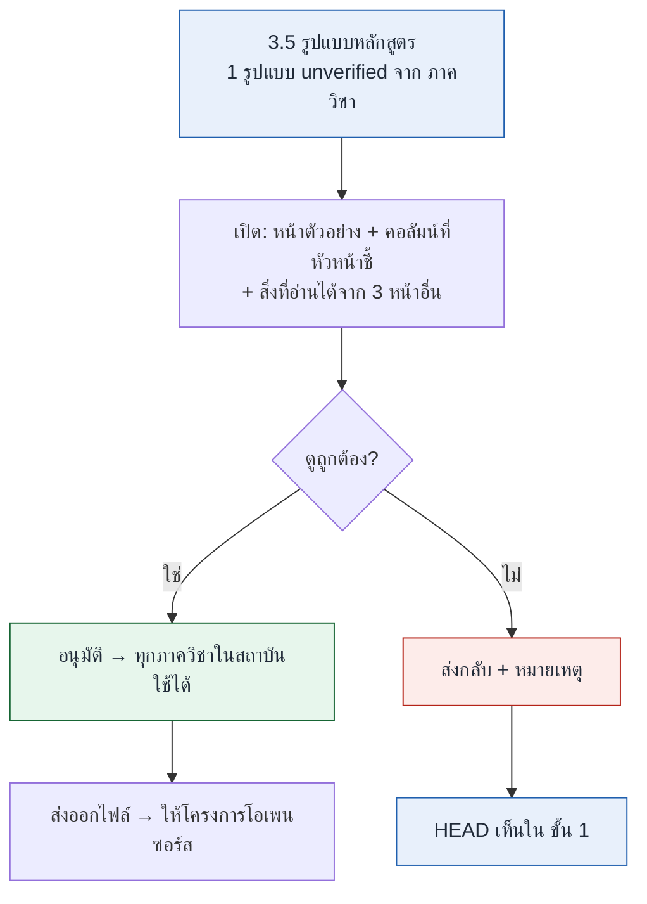
```mermaid
flowchart TD
  classDef page fill:#e8f0fb,stroke:#1f5fae,color:#1f2937
  classDef err fill:#fdecea,stroke:#b42318,color:#1f2937
  classDef ok fill:#e7f6ec,stroke:#166534,color:#1f2937

  A["3.5 รูปแบบหลักสูตร<br/>1 รูปแบบ unverified จาก ภาควิชา"]:::page --> B["เปิด: หน้าตัวอย่าง + คอลัมน์ที่หัวหน้าชี้<br/>+ สิ่งที่อ่านได้จาก 3 หน้าอื่น"]
  B --> Q{"ดูถูกต้อง?"}
  Q -->|ใช่| Y["อนุมัติ → ทุกภาควิชาในสถาบันใช้ได้"]:::ok
  Y --> E["ส่งออกไฟล์ → ให้โครงการโอเพนซอร์ส"]
  Q -->|ไม่| N["ส่งกลับ + หมายเหตุ"]:::err
  N --> H["HEAD เห็นใน ขั้น 1"]:::page
```

### F12 มอบงานให้ผู้ช่วย

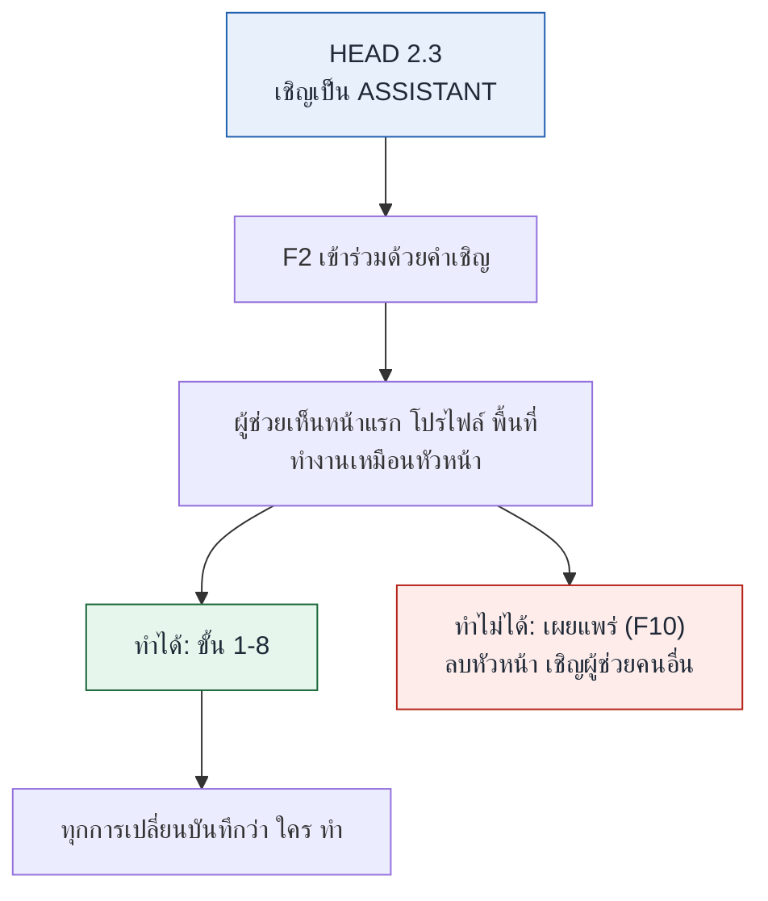
```mermaid
flowchart TD
  classDef ok fill:#e7f6ec,stroke:#166534,color:#1f2937
  classDef err fill:#fdecea,stroke:#b42318,color:#1f2937
  classDef page fill:#e8f0fb,stroke:#1f5fae,color:#1f2937

  A["HEAD 2.3<br/>เชิญเป็น ASSISTANT"]:::page --> B["F2 เข้าร่วมด้วยคำเชิญ"]
  B --> C["ผู้ช่วยเห็นหน้าแรก โปรไฟล์ พื้นที่ทำงานเหมือนหัวหน้า"]
  C --> OK["ทำได้: ขั้น 1-8"]:::ok
  C --> NO["ทำไม่ได้: เผยแพร่ (F10)<br/>ลบหัวหน้า เชิญผู้ช่วยคนอื่น"]:::err
  OK --> L["ทุกการเปลี่ยนบันทึกว่า ใคร ทำ"]
```

---

## 6. วงจรสถานะ

### 6.1 Profile / เวอร์ชันตาราง

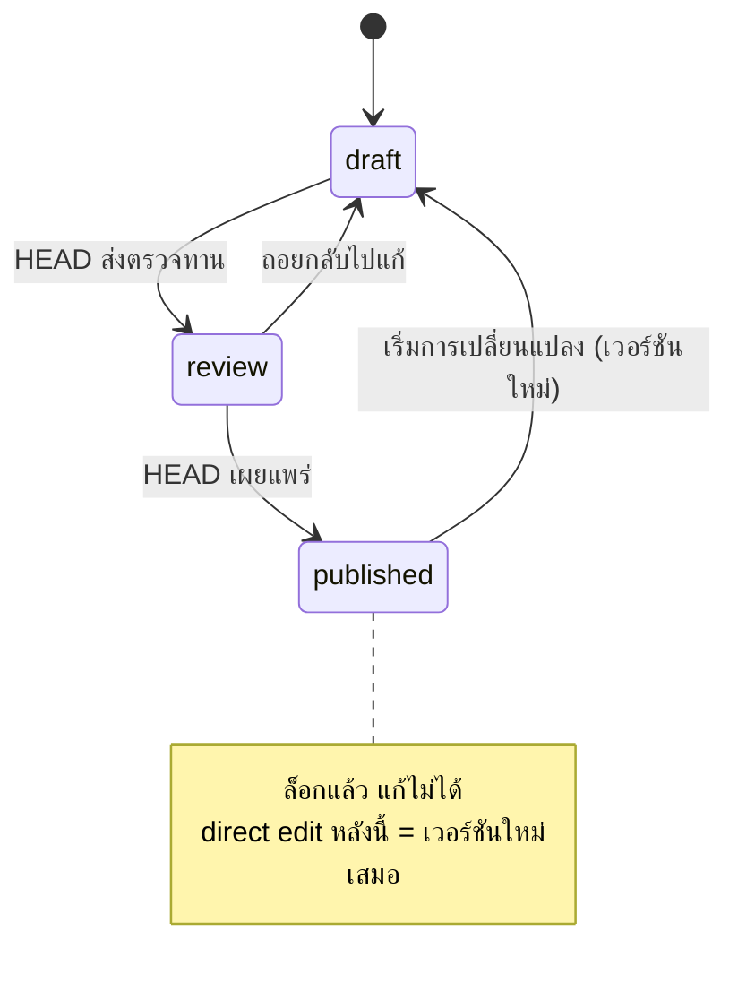
```mermaid
stateDiagram-v2
  [*] --> draft
  draft --> review: HEAD ส่งตรวจทาน
  review --> draft: ถอยกลับไปแก้
  review --> published: HEAD เผยแพร่
  published --> draft: เริ่มการเปลี่ยนแปลง (เวอร์ชันใหม่)
  note right of published
    ล็อกแล้ว แก้ไม่ได้
    direct edit หลังนี้ = เวอร์ชันใหม่เสมอ
  end note
```

### 6.2 ขั้นในพื้นที่ทำงาน (ต่อชั้นปี)

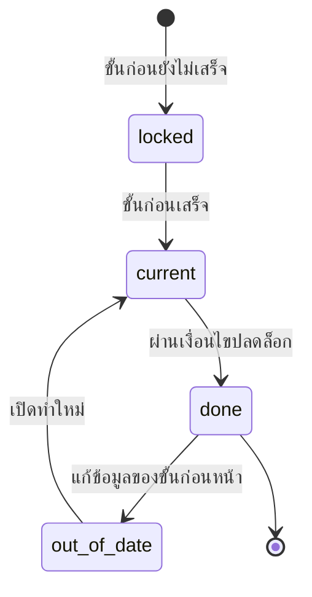
```mermaid
stateDiagram-v2
  [*] --> locked: ขั้นก่อนยังไม่เสร็จ
  locked --> current: ขั้นก่อนเสร็จ
  current --> done: ผ่านเงื่อนไขปลดล็อก
  done --> out_of_date: แก้ข้อมูลของขั้นก่อนหน้า
  out_of_date --> current: เปิดทำใหม่
  done --> [*]
```

### 6.3 ปัญหาจากข้อมูลอาจารย์ (ISSUE)

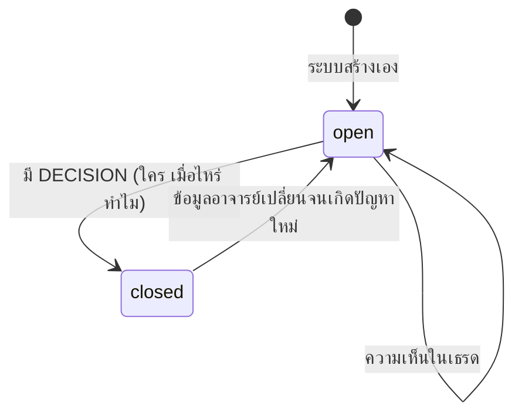
```mermaid
stateDiagram-v2
  [*] --> open: ระบบสร้างเอง
  open --> open: ความเห็นในเธรด
  open --> closed: มี DECISION (ใคร เมื่อไหร่ ทำไม)
  closed --> open: ข้อมูลอาจารย์เปลี่ยนจนเกิดปัญหาใหม่
```

### 6.4 คำขอเปลี่ยนแปลง (CHANGE_REQUEST)

```mermaid
stateDiagram-v2
  [*] --> waiting: อาจารย์ส่งคำขอ
  waiting --> approved: HEAD อนุมัติ (รันใหม่แบบน้อยที่สุด)
  waiting --> rejected: HEAD ปฏิเสธ + หมายเหตุ
  approved --> [*]
  rejected --> [*]
```

### 6.5 การรัน solver (GENERATION_RUN)

```mermaid
stateDiagram-v2
  [*] --> queued: ต้อง acknowledge pre-check ก่อน
  queued --> running
  running --> ok: ลงครบทุกคาบ
  running --> partial: มีคาบยังไม่ลง (ไม่ใช่ความล้มเหลว)
  running --> failed: solver ค้าง/แครช (เก็บผลดีล่าสุด)
  running --> cancelled: ผู้ใช้ยกเลิก
  ok --> [*]
  partial --> [*]
  failed --> [*]
  cancelled --> [*]
```

สถานะ `queued/running/cancelled` และชื่อ `ok/partial/failed` เป็นข้อเสนอของฝั่ง Frontend ยังไม่ได้ตกลงกับ backend ดู [เส้น API §7.1](api.md)
